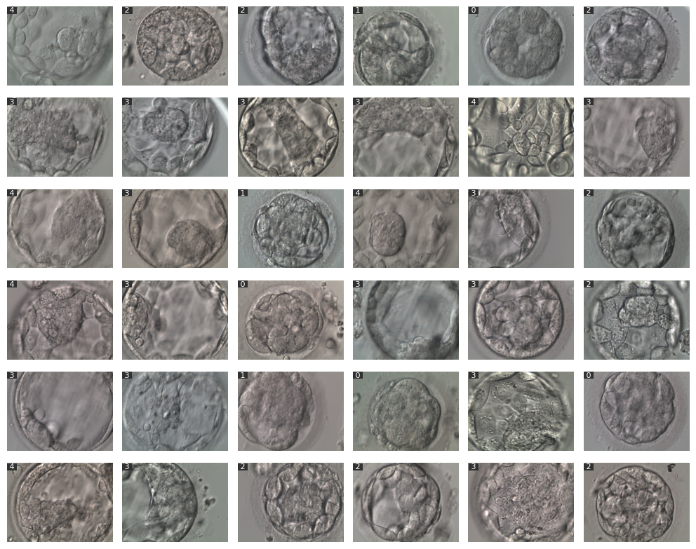

Open Fertility is an open-source project dedicated to advancing fertility analysis and prediction through machine learning. The goal is to foster a __community-driven__ initiative that empowers fertility professionals, researchers, and enthusiasts. 

Inspired by the paper [_An annotated human blastocyst dataset to benchmark deep learning architectures for in vitro fertilization_](https://www.nature.com/articles/s41597-023-02182-3) the aim is to leverage the open data they published to develop initial models.

The primary objectives are to:

- Cultivate an inclusive and collaborative community, bringing together experts and enthusiasts.
- Provide comprehensive tools for training, evaluating, and applying machine learning techniques.
- Effective data visualization, to gain valuable insights and interpret data with clarity.
- Deliver intuitive user interfaces that grant easy access to the models.


Get in touch if you feel interested in participating!

# Installation

During this early develoment stage, a PyPi pip installation is still not provided.

To use the current version, follow these steps:

1. Download and unzip (`code` button above the files) or clone the repository 
3. Navigate to the directory containing the repository
4. Run `pip install .` 


# Early features

### Download the blastocyst dataset

```python
import openfertility as of

blasto2k = of.datasets.blasto2k.Dataset()
blasto2k.download()

```

### Generate training set

```python
import openfertility as of

blasto2k = of.datasets.blasto2k.Dataset()
blasto2k.download()
train_set = of.datasets.splits.TrainSet(blasto2k)

print(f'Image shape: {train_set[0][0].shape}')
>>> Image shape: torch.Size([3, 384, 512])

```

### Show random grid from dataset
```python
import openfertility as of

# Get the dataset
blasto2k = of.datasets.blasto2k.Dataset()
blasto2k.download()

# Generate train set
train_set = of.datasets.splits.TrainSet(blasto2k)

# By default shows labels on the top left corner
of.display.img.grid(train_set) 

```
